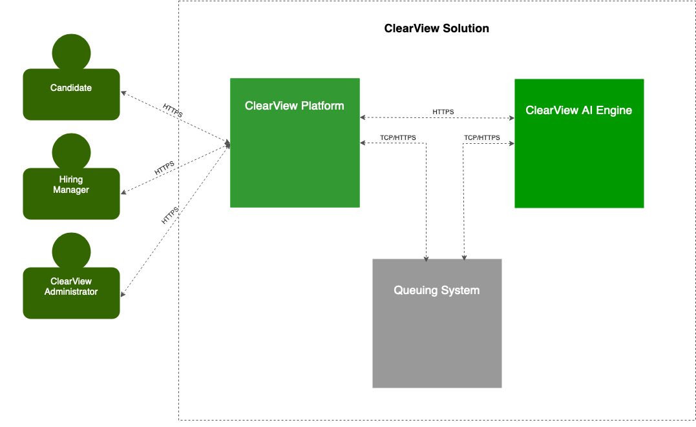

## Builder's Glitch:   
Builder's Glitch! We're a passionate team of IT professionals who thrive on solving complex challenges. 

| Name | Full Name | LinkedIn Profile |
| :---- | :---- | :---- |
| Chenthil | Chenthilnathan, Swaminathan | [LinkedIn](https://www.linkedin.com/in/chenthil-nathan-s/)  |
| Dinesh | Dinesh Abraham, Thangasamy | [LinkedIn](https://www.linkedin.com/in/dinesh-abraham-thangasamy/)  |
| Suresh | Suresh Kumar, Sundararajulu | [LinkedIn](http://www.linkedin.com/in/sureshkumargs)  |
| Vijji | Vijaya lakshmi, Guruswamy | [LinkedIn](https://www.linkedin.com/in/vijji-guruswamy-a2020714/)  |

# Introduction:  
Welcome to the **2024 Autumn O'Reilly Architectural Kata**, where we will be assessing the architectural solution for the **ClearView Platform**—an anonymized hiring platform designed to promote **Diversity, Equity, and Inclusion (DEI)**
 

## Company Overview

[Diversity Cyber Council](https://www.diversitycybercouncil.com/) is a 501c3 Non-Profit that serves under-represented demographics in the tech industry by facilitating education, training, and staffing opportunities to establish a sustainable and diverse talent pipeline to the workforce.

Diversity Cyber Council’s goal is to establish a sustainable and diverse talent pipeline that extends career equity to underrepresented demographics by providing access to competent training programs that lead to direct employment opportunities.

Diversity Cyber Council aims to enhance inclusion and representation in the tech industry through training, mentoring, networking, and visibility programs.

## Original Business Requirements for ClearView System
[Original Requirement for ClearView System](original%20requirements.md)

# Translating Business Requirements to System Capabilities and Interactions

## Candidate \- System Interaction

* Candidates can register on the ClearView platform and create a profile by providing basic demographic and contact information.   
* The ClearView platform sends a confirmation email, and candidates must verify their account.  
* Candidates upload their resume and complete additional required fields.  
* The ClearView AI Engine analyzes the resume and provides resume improvement tips to align with the job market and best practices.  
* Candidates can either accept the suggestions generated by the ClearView AI Engine or manually modify their resume based on the recommendations.  
* The ClearView AI Engine anonymizes all personal identifiable information (PII) that may introduce bias, such as age, gender, race, culture, or lifestyle characteristics.  
* The ClearView AI Engine matches the anonymized resume to relevant job postings by comparing candidate experience and skill sets with job descriptions and generating a Talent Match Score.   
* The ClearView AI Engine generates a story based on S.M.A.R.T goal methodology per the candidate's experience specific to each role matched to make the candidate's qualifications more straightforward to hiring managers.  
  * The story generated per the S.M.A.R.T goal method will be called the S.M.A.R.T Profile.   
* Candidates receive notifications when Hiring managers express interest in their profile.  
  * (e.g., "Hiring Manager from XYZ expressed interest in your profile for Operations Manager role in Portland, Oregon").  
* Candidates can interact with Hiring Managers who have unlocked their profile through the ClearView platform.   
  * The feature of Chat or in-app interaction between the Candidate and the Hiring Manager will not be part of the current scope but can be considered for the future.    
* Candidates can remove or update their resumes at any point.   
* Candidates can mark their profiles as "inactive,"   
  * ClearView AI Engine will not match job postings with any inactive profile.   
  * Admin can set any profile to active or Inactive, but this feature will not be part of the current scope and can be considered for the future.   
* After completing an interview, candidates receive a 5-question survey to rate the interviewer and provide feedback on the process.

## Hiring Manager \- System Interaction

* Employers or hiring managers register on the ClearView platform, with public data auto-filled and non-public data manually input.  
* The hiring manager uploads job descriptions and relevant role requirements.  
* Hiring managers access a dashboard to manage job postings, view matched candidates and their Talent Match Score scores and perform relevant administrative tasks.  
* Hiring managers view anonymized profiles of those candidates who are matched.  
* Hiring managers can unlock a candidate's complete profile, and they decide to offer an interview to the candidate.   
  * ClearView Platform initiates an invoice for the company when the hiring manager unlocks the candidate's unmasked resume.   
* After an interview, Hiring managers complete a 5-question survey about candidates and provide feedback on the process.  
* Hiring managers can include a DEI Consultant in the interview process to monitor for potential bias.   
  * Including a DEI Consultant to shadow interviews is an additional service offered at a cost.  
* Hiring managers are notified when a new match is made to any of their roles posted.   
  * The notifications can be consolidated into a single message across all job postings and redirect the hiring manager to the dashboard.  
* **Highlighting Revenue Pattern of ClearView Platform:** The ClearView platform generates revenue when a company view a candidate’s complete profile or when the company chooses to involve a DEI consultant in the interview process. 

## ClearView Admin \- System Interaction

* ClearView Admin ensures that any changes to a candidate's status, whether hired, rejected, accepted, or currently interviewing, are updated and reflected across the platform, promoting transparency in the hiring process.  
* ClearView Admin collects and maintains detailed demographic data for all candidates. This information is beneficial for tracking outcomes, such as who gets hired or rejected, enabling a more profound analysis of hiring patterns and diversity.  
* The ClearView Admin maintains an internal system that tracks user behaviours, including hiring patterns and candidate success rate, providing valuable insights for internal monitoring and decision-making.  
* ClearView Admin generates detailed reports for the company’s executive management, focusing on hiring trends and potential bias. These reports help leadership understand and mitigate bias in their hiring decisions.  
* ClearView Admin compiles unconscious bias reports and other monthly reports with KPIs and metrics related to the interview process and shares them with the hiring company's executive management.   
  * The ClearView admin can facilitate actionable recommendations or bias-reduction strategies that executives can use to improve fairness in their hiring and interview processes.

## DEI Consultant \- System Interaction

* DEI Consultants shadow live interviews at the request of the hiring manager to monitor for potential unconscious bias.  
* DEI Consultants document any unconscious bias during the interview process, such as biased language or behaviour.  
  * DEI Consultants submit their findings on unconscious bias to the ClearView Admin for further analysis.  
* Future: DEI Consultants can be replaced by AI Engine supporting DEI models. This is a scalable and cost-efficient approach.

# Architecture

As a non-profit organization, the Diversity Cyber Council (DCC) will face budgetary constraints until the ClearView project begins generating revenue. Therefore, the initial solution must be cost-effective and straightforward, with the flexibility to scale as demand grows or when DCC secures additional funding through profits or external investments.

Critical system components, particularly those supporting DCC's core operations, must maintain high availability—ideally around the clock but at least during peak business hours. The availability of business-critical components is crucial since DCC's revenue is directly tied to delivering value to partners, candidates, and hiring managers. Any downtime or inefficiency could negatively impact these relationships and revenue.

Given these considerations, we propose a solution that consists of two core services adopting a hybrid approach:

* **ClearView AI Engine** – to handle all automated tasks powered by AI models
* **ClearView Platform** – to handle other essential business functionalities.

## ClearView AI Engine:
The ClearView AI Engine must be designed for scalability. As the volume of candidate profiles and job postings increases, the system must seamlessly expand to accommodate the growing demand. Since AI model integration is resource-intensive, the infrastructure should efficiently support the increasing demand.

The AI landscape is evolving rapidly with frequent updates and advancements. To maintain a competitive edge and deliver an optimal user experience, the AI Engine should be adaptable, allowing DCC to integrate new AI technologies and improvements as they emerge. This focus is on evolvability, where the system evolves along with the advancements in the AI industry while maintaining its relevance and effectiveness in managing user needs.

### Architecture Characteristic Mapping
Scalability, Evolvability and Availability

### Chosen Architecture
Event Driven

## ClearView Platform
ClearView Platform allows key users, including candidates, hiring managers, and ClearView administrators, to carry out their daily activities and interactions. Its primary function is to enable seamless user experiences by handling essential tasks such as onboarding, dashboard management, notifications, and other entity-oriented actions.

While these functions are standard across many software solutions and with AI Engine handling the most resource-intensive workload, we have focused on cost-effectiveness, simplicity, and a domain-driven architecture for the ClearView Platform.

Adopting a domain-driven design ensures the platform efficiently meets current needs while maintaining flexibility for future growth. As the platform expands and new requirements emerge, individual components can be scaled and deployed independently, providing the necessary adaptability.

### Architecture Characteristic Mapping
Cost-effective/Feasibility, Simplicity/Maintainable, Domain Driven according to the capabilities to suppor the extraction of these
into its own services.

### Chosen Architecture
Modular Monolith

## Deployment
The final deployment diagram looks like belo. For more details please check the [Deployment section](deployment/Deployment.md)

# Solution

There are 2 main components in the ClearView System

* [ClearView Engine](aiengine.md) 
* [ClearView Platform](platform.md)

