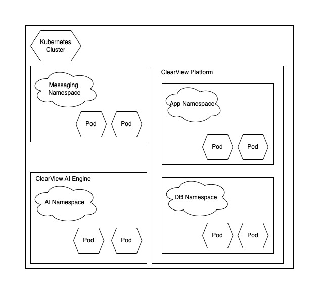

## Builder's Glitch:   
Builder's Glitch! We're a passionate team of IT professionals who thrive on solving complex challenges. 

| Name | Full Name | LinkedIn Profile |
| :---- | :---- | :---- |
| Chenthil | Chenthilnathan, Swaminathan | [LinkedIn](https://www.linkedin.com/in/chenthil-nathan-s/)  |
| Dinesh | Dinesh Abraham, Thangasamy | [LinkedIn](https://www.linkedin.com/in/dinesh-abraham-thangasamy/)  |
| Suresh | Suresh Kumar, Sundararajulu | [LinkedIn](http://www.linkedin.com/in/sureshkumargs)  |
| Vijji | Vijaya lakshmi, Guruswamy | [LinkedIn](https://www.linkedin.com/in/vijji-guruswamy-a2020714/)  |

# Introduction:  
Welcome to the **2024 Autumn O'Reilly Architectural Kata**, where we will be assessing the architectural solution for the **ClearView Platform**—an anonymized hiring platform designed to promote **Diversity, Equity, and Inclusion (DEI).**
 
## Company Overview

[Diversity Cyber Council](https://www.diversitycybercouncil.com/) is a 501c3 Non-Profit that serves under-represented demographics in the tech industry by facilitating education, training, and staffing opportunities to establish a sustainable and diverse talent pipeline to the workforce.

Diversity Cyber Council’s goal is to establish a sustainable and diverse talent pipeline that extends career equity to underrepresented demographics by providing access to competent training programs that lead to direct employment opportunities.

Diversity Cyber Council aims to enhance inclusion and representation in the tech industry through training, mentoring, networking, and visibility programs.

## Original Business Requirements for ClearView System
[Original Requirement for ClearView System](original%20requirements.md)

# Mapping Business Requirements to System Interactions
To refine the original requirements, we developed an actor-system interaction mapping model to streamline the user journeys to improve clarity and usability. We organized them around core system functionalities for **_Candidates, Hiring Managers, and ClearView Administrators_***. 

We focused on thorough analysis to identify the core objectives and critical problems, such as reducing hiring bias and improving candidate-job matching and essential features like AI-driven resume analysis, anonymization, and data aggregation, ensuring that these functionalities are addressed. 

By honing in on these priorities and considering the financial implications of developing a full-blown AI solution, we took a scalable approach, implementing critical and core AI features that provide immediate value while allowing room for future enhancements. This approach ensures that the system remains cost-efficient yet adaptable. 

[Refined Requirement for ClearView System](RefinedRequirements.md)

[Glossary of Terms](Glossary.md)*

# Architecture
As a non-profit organization, the Diversity Cyber Council (DCC) will face budgetary constraints until the ClearView project begins generating revenue. Therefore, the initial solution must be cost-effective and straightforward, with the flexibility to scale as demand grows or when DCC secures additional funding through profits or external investments.

Critical system components, particularly those supporting DCC's core operations, must maintain high availability—ideally around the clock but at least during peak business hours. The availability of business-critical components is crucial since DCC's revenue is directly tied to delivering value to partners, candidates, and hiring managers. Any downtime or inefficiency could negatively impact these relationships and revenue.

Given these considerations, we propose a solution that consists of two core services adopting a hybrid approach:

* **ClearView AI Engine** – to handle all automated tasks powered by AI models
* **ClearView Platform** – to handle other essential business functionalities.

## ClearView AI Engine:
The ClearView AI Engine must be designed for availability and scalability to support core business operations. As the volume of candidate profiles and job postings increases, the system must seamlessly expand to accommodate the growing demand. Since AI model integration is resource-intensive, the infrastructure should efficiently support the increasing demand.

The AI landscape is evolving rapidly with frequent updates and advancements. To maintain a competitive edge and deliver an optimal user experience, the AI Engine should be adaptable, allowing DCC to integrate new AI technologies and improvements as they emerge. This focus is on evolvability, where the system evolves along with the advancements in the AI industry while maintaining its relevance and effectiveness in managing user needs.

### Architecture Characteristic Mapping
Scalability, Evolvability and Availability

### Chosen Architecture
Event Driven

## ClearView Platform
ClearView Platform allows key users, including candidates, hiring managers, and ClearView administrators, to carry out their daily activities and interactions. Its primary function is to enable seamless user experiences by handling essential tasks such as onboarding, dashboard management, notifications, and other entity-oriented actions.

While these functions are standard across many software solutions and with AI Engine handling the most resource-intensive workload, we have focused on cost-effectiveness, simplicity, and a domain-driven architecture for the ClearView Platform.

Adopting a domain-driven design ensures the platform efficiently meets current needs while maintaining flexibility for future growth. As the platform expands and new requirements emerge, individual components can be scaled and deployed independently, providing the necessary adaptability.

### Architecture Characteristic Mapping
Cost-effective/Feasibility, Simplicity/Maintainable, Domain-Driven according to the functional capabilities to support the extraction of these into its own services.

### Chosen Architecture
Modular Monolith

## Designing the architecture
The ClearView solution combines an AI-powered engine and a user-facing platform optimized for both mobile and web.

The ClearView AI Engine leverages an **Event-Driven Architecture** to efficiently handle complex, asynchronous tasks like candidate matching, resume enhancement, and talent scoring, while maintaining scalability and flexibility as AI technologies evolve.
* More on [**ClearView Engine**](aiengine.md)

The ClearView Platform uses a **Modular Monolith Architecture** to manage user interactions, focusing on cost-effectiveness, quick time-to-market, and future scalability. Together, these components form a cohesive solution that empowers companies to participate in diversity hiring initiatives, offering a scalable, adaptable, and user-friendly system for candidates and hiring managers.
* More on [**ClearView Platform**](platform.md)

**Queuing system**
The proposed solution for both the **ClearView AI Engine** and the **ClearView Platform** will utilize a queueing system to manage asynchronous communication between the two components. The ClearView AI Engine processes tasks such as candidate matching, resume enhancement, and talent scoring asynchronously, placing the results onto the queue once the jobs are completed. The ClearView Platform then pulls the processed data from the queue to display updated information to users in real time, such as job matches or enhanced resumes. Implementors have the flexibility to choose a cost-effective queueing solution, such as **RabbitMQ**, **Amazon SQS**, or **Kafka**, depending on their operational needs.

## Deployment
The final deployment view is shown below. For more details, please check the [Deployment section](deployment/Deployment.md)

## Summary
Placeholder for summary
