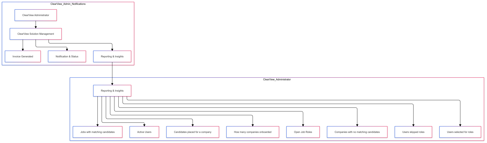

# Mapping Business Requirements to System Interactions

Description of the standardized terms, component names, and actors are defined in the solution is documented in [Glossary of Terms](Glossary.md)

## Candidate \- System Interaction
* Candidates can register on the ClearView platform and create a profile by providing basic demographic and contact information.   
* The ClearView platform sends a confirmation email, and candidates must verify their account.  
* Candidates upload their resume and complete additional required fields.  
* The ClearView AI Engine analyzes the resume and provides resume improvement tips to align with the job market and best practices.  
* Candidates can either accept the suggestions generated by the ClearView AI Engine or manually modify their resume based on the recommendations.  
* The ClearView AI Engine anonymizes all personal identifiable information (PII) that may introduce bias, such as age, gender, race, culture, or lifestyle characteristics.  
* The ClearView AI Engine matches the anonymized resume to relevant job postings by comparing candidate experience and skill sets with job descriptions and generating a Talent Match Score.   
* The ClearView AI Engine generates a story based on S.M.A.R.T goal methodology per the candidate's experience specific to each role matched to make the candidate's qualifications more straightforward to hiring managers.  
  * The story generated per the S.M.A.R.T goal method will be called the S.M.A.R.T Profile.   
* Candidates receive notifications when Hiring managers express interest in their profile.  
  * (e.g., "Hiring Manager from XYZ expressed interest in your profile for Operations Manager role in Portland, Oregon").  
* Candidates can interact with Hiring Managers who have unlocked their profile through the ClearView platform.   
  * The feature of Chat or in-app interaction between the Candidate and the Hiring Manager will not be part of the current scope but can be considered for the future.    
* Candidates can remove or update their resumes at any point.   
* Candidates can mark their profiles as "inactive,"
* After completing an interview, candidates receive a 5-question survey to rate the interviewer and provide feedback.
  
    
## Hiring Manager \- System Interaction
* Employers or hiring managers register on the ClearView platform, with public data auto-filled and non-public data to be manually added.  
* The hiring manager uploads job descriptions and relevant role requirements.  
* Hiring managers access a dashboard to manage job postings, view matched candidates and their Talent Match Score scores and perform relevant administrative tasks.  
* Hiring managers view anonymized profiles of those candidates who are matched.  
* Hiring managers can unlock a candidate's complete profile, and they decide to offer an interview to the candidate.
  * ClearView Platform initiates an invoice for the company when the hiring manager unlocks the candidate's unmasked resume.   
* After an interview, Hiring managers complete a 5-question survey about candidates and provide feedback on the process.  
* Hiring managers can include a DEI Consultant in the interview process to monitor for potential bias.   
  * Including a DEI Consultant to shadow interviews is an additional service offered at a cost.  
* Hiring managers are notified when a new match is made to any of their roles posted.   
  * The notifications can be consolidated into a single message across all job postings and redirect the hiring manager to the dashboard.  
* **Highlighting Revenue Pattern of ClearView Platform:** The ClearView platform generates revenue when a company view a candidate’s complete profile or when the company chooses to involve a DEI consultant in the interview process.
   

## ClearView Admin \- System Interaction
* ClearView Admin ensures that any changes to a candidate's status, whether hired, rejected, accepted, or currently interviewing, are updated and reflected across the platform, promoting transparency in the hiring process.  
* ClearView Admin collects and maintains detailed demographic data for all candidates. This information is beneficial for tracking outcomes, such as who gets hired or rejected, enabling a more profound analysis of hiring patterns and diversity.  
* The ClearView Admin maintains an internal system that tracks user behaviours, including hiring patterns and candidate success rate, providing valuable insights for internal monitoring and decision-making.  
* ClearView Admin generates detailed reports for the company’s executive management, focusing on hiring trends and potential bias. These reports help leadership understand and mitigate bias in their hiring decisions.  
* ClearView Admin compiles unconscious bias reports and other monthly reports with KPIs and metrics related to the interview process and shares them with the hiring company's executive management.   
  * The ClearView admin can facilitate actionable recommendations or bias-reduction strategies that executives can use to improve fairness in their hiring and interview processes.
 

## DEI Consultant \- System Interaction
* DEI Consultants shadow live interviews at the request of the hiring manager to monitor for potential unconscious bias.  
* DEI Consultants document any unconscious bias during the interview process, such as biased language or behaviour.  
  * DEI Consultants submit their findings on unconscious bias to the ClearView Admin for further analysis.  
  
## Challenges & Assumptions
* The SMART profile story is generated by comparing anonymized resumes with job postings. This process occurs for every suitable job match.
* Candidates are limited to uploading a single resume to their profile.
* The queuing system is designed to be vendor-agnostic, allowing implementers to select solutions based on their specific needs and constraints.

## Out of Scope
* The current scope does not consider the in-app scheduling of DEI consultants and invoicing for their inclusion in the interview process.
* The current scope does not include in-app scheduling of interviews between candidates, hiring managers, and DEI consultants. 
* In-app interaction or chat options between candidates and hiring managers are not considered in the current scope, though these features may be considered in the future.
* The Admin can set any profile to active or Inactive, but this feature is outside the current scope and can be considered for the future.   
* The current scope does not consider matching any inactive candidate profile with job postings. 

## Future Vision
* Candidates can upload and manage multiple versions of their resumes under a single profile.
* Suppose a hiring manager creates multiple job profiles, and a candidate’s resume matches more than one. In that case, the system will notify the hiring manager that the resume has already been reviewed, preventing duplicate charges.
* Currently, the system matches candidates to jobs with a Talent Match Score of 80%, but future versions will allow hiring managers to customize these matching parameters.
* In the future, the ClearView solution may incorporate an AI-based DEI model to monitor interviews and analyze hiring bias, offering a scalable and cost-effective solution.

